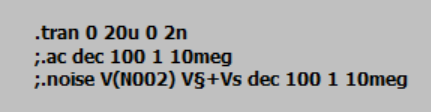
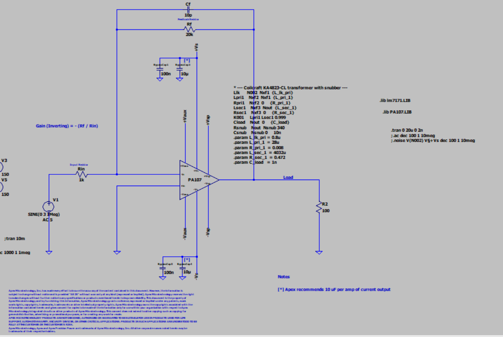
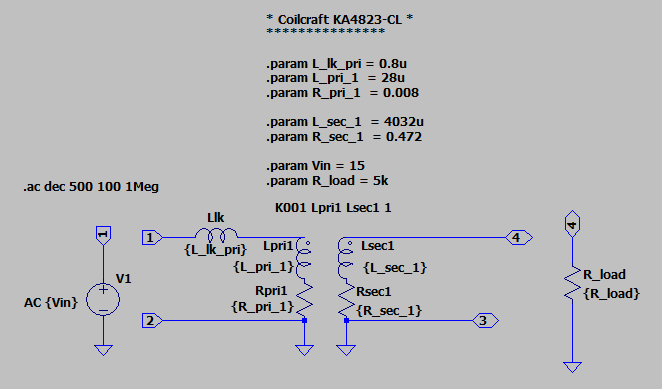
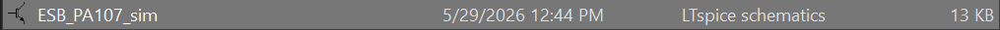
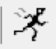
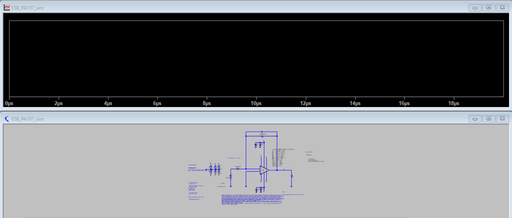
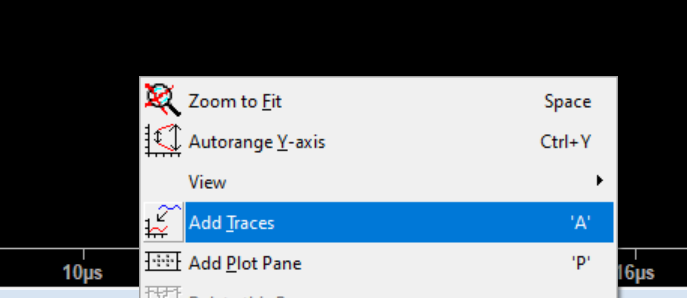
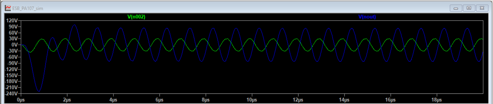

# PA107 Power Amplifier — LTspice Simulation Guide

A step-by-step guide for running and modifying the LTspice simulation of the PA107 RF power amplifier and step-up transformer used in the charge detection mass spectrometer. You should hopefully be able to follow it cold and end up with working simulations! For all questions I am reachable at carsun@berkeley.edu.

If you're already comfortable with LTspice, jump to [Understanding the Netlist](#understanding-the-netlist) or [Parameters You Can Tweak](#parameters-you-can-tweak).

## Table of Contents

1. [What This Project Is](#what-this-project-is)
2. [Background Concepts](#background-concepts)
3. [Installing LTspice](#installing-ltspice)
4. [Files You Need](#files-you-need)
5. [Opening and Running Your First Simulation](#opening-and-running-your-first-simulation)
6. [Setting Up Library Files (Critical Step)](#setting-up-library-files-critical-step)
7. [Understanding the Netlist](#understanding-the-netlist)
8. [Reading the Waveform Plot](#reading-the-waveform-plot)
9. [The Three Simulation Modes](#the-three-simulation-modes)
10. [Parameters You Can Tweak](#parameters-you-can-tweak)
11. [Common Mistakes and Gotchas](#common-mistakes-and-gotchas)
12. [Troubleshooting](#troubleshooting)
13. [Cross-Reference: The PCB](#cross-reference-the-pcb)

## What This Project Is

We're simulating a high-voltage RF power amplifier chain that drives a step-up transformer feeding the quadrupole ion guides in a mass spectrometer. The simulation file you're working with represents:

- A **PA107 power op-amp** (high-voltage, high-slew-rate amplifier) configured at gain ×20 (Rin is 1k, Rf is 20k. Keep in mind that this is an inverting amplifier, so inverting amplifier gain is -Rf/Rin)
- A **Coilcraft KA4823-CL step-up transformer** (1:12 turns ratio) on the amp's output. This is a similar transformer to the ones we will be winding, with a pretty thorough SPICE model in that it models multiple parasitics (capacitive, inductive, resistive), but the actual performance of the transformer will depend on what we wind. :)
- A **capacitive load** (~1 nF) representing the ion guide on the transformer secondary. This load spec was given to us at the start of undertaking this project.
- A **snubber network** to damp parasitic ringing

The simulation lets you predict how the real hardware will behave **before** you build it, so you can choose component values, drive frequencies, and operating conditions safely!

## Background Concepts

### What is LTspice?

LTspice is a free circuit simulator made by Analog Devices (originally Linear Technology, hence the "LT"). Fun fact: SPICE was developed at Berkeley! It takes a description of a circuit and predicts what voltages and currents will appear at every node when you apply inputs. You can simulate:

- **Time-domain behavior**: what voltage waveforms look like over time (.tran)
- **Frequency response**: gain and phase versus frequency (.ac, etc.)
- **Noise** — predicted noise floor at any node (.noise)



*Examples of all 3 simulation types in the PA107. The semicolon ; prior to the ac and noise simulations means they're commented out, s.t. just the transient simulation is being run.*

LTspice is the standard for analog circuit simulation. It's free, runs on Windows and Mac, and is widely used in industry and academia.

### What is a netlist?

A **netlist** is a plain-text description of a circuit. Every line describes one component, its connections, and its value. For example:

```spice
R1 nodeA nodeB 10k
```

means: "there is a 10 kΩ resistor named R1 connected between nodeA and nodeB." Nodes are just names for electrical connection points. 0 is always ground, and other nodes can have any name you like (N002, Vout, +Vs, etc.). Simulations that you run will use these netlists as well, and when you end up plotting a result of a simulation, because everything in the "net" was evaluated upon running the simulation, you'll be able to pick and plot any net you want without having to rerun.

LTspice can work two ways: - **Schematic mode** (.asc files), where you draw the circuit visually or **Netlist mode** (.cir files), where you write the circuit as text. In the PA107 sims you can see that the PA107 is represented as a symbol, so an .asc file, but the Coilcraft transformer was added in netlist mode to spare me the pain of rewiring the circuit.



*PA107 in schematic form, but you can see the transformer has been added as a netlist.*



*Figure provided by Coilcraft representative of the transformer were drawn out in schematic form. It is equivalent to the netlist form seen in the figure above, save for R_load -> C_load. You can adjust the model that exists by editing the netlist in the PA107 schematic file.*

## Installing LTspice

1. Go to the official download page: https://www.analog.com/en/resources/design-tools-and-calculators/ltspice-simulator.html
2. Click Download for Windows or Download for Mac depending on your OS.
3. Run the installer with all default options.
4. After installation, launch LTspice. You should see a mostly empty window with menus across the top.

That's it for installation! No license needed.

I've seen people run into niche LTSpice issues that look like simulation convergence issues / windows compatibility issues at large with using the newer version (24) of LTSpice on Windows. If so, try uninstalling that version and then installing version 17.1.15 at this link: [https://ltspice.analog.com/download/17.1.15/LTspice64.msi](https://ltspice.analog.com/download/17.1.15/LTspice64.msi)

After you install it, the software will tell you there exists a newer version and ask if you want to upgrade. You do not! Stay on 17.1.15.

## Files You Need

For this simulation to run, you need **three files in the same folder**:

| File              | What it is                                                                |
|-------------------|---------------------------------------------------------------------------|
| ESB_PA107_sim.cir | The main netlist (your simulation file)                                   |
| PA107.LIB         | The SPICE model for the PA107 op-amp                                      |
| lm7171.LIB        | The SPICE model for the LM7171 op-amp (referenced but not currently used) |

**Where to get them:** - The .cir file lives in this repository - The .LIB files come from Apex Microtechnology (PA107) and Texas Instruments (LM7171). They should be checked into this repo alongside the .cir file. If they're missing, download them from: - PA107: https://www.apexanalog.com → search "PA107" → "Models" tab - LM7171: https://www.ti.com → search "LM7171" → "Tools & software" section. But I have provided all three files in the handover in one zip folder, and if any issues arise with downloading them off the web, please let me know!

## Opening and Running Your First Simulation

1. Launch LTspice.
2. Go to **File → Open**.
3. Navigate to your working directory and open ESB_PA107_sim.asc.



*Open this file in your files!*

*If trying to open just a netlist file (for example, just opening the transformer as a netlist), you will have to go to the open file dialog, change the file type filter at the bottom from "Schematics (*.asc)" to **"All Files (*.*)"** so you can see .cir files, then open the file of your choosing.

4. Press the **Run** button (looks like a little running stick figure in the toolbar) or hit **Ctrl+R**.

 *The run button.*

If everything is set up correctly, a black plot window opens (with no traces yet) and the simulation runs in a few seconds.



*Black plot window that shows up when I finish running.*

Add a trace to see the output. Click on the plot window to activate it, then press **Ctrl+Alt+A**. A dialog appears with a list of node names. Either:

- Type V(nout) in the "Expression(s) to add" box, or
- Click V(nout) in the list



*Right click the black plot window to add any traces you'd like (basically, to plot any node you'd like).*

Click OK. You should now see a sine wave — that's the voltage at the transformer's secondary output over time.

Add a second trace: V(N002) is the PA107 output (the amp's output, before the transformer).



*Do notice that there is a settling time of a couple of microseconds at the current configuration before the transient simulation settles to a completely oscillatory motion.*

## Setting Up Library Files (Critical Step)

The netlist references external library files for the op-amp models:

```spice
.lib lm7171.LIB
.lib PA107.LIB
```

These .lib directives tell LTspice to "load the PA107 model definition from this file." LTspice looks for these files in:

1. **The same folder as your .cir file**. This is probably the best option to take!
2. The complete path you give it where this library exists. (For example: C:\Users\YourName\AppData\Local\LTspice\lib\sub\)

### If the simulation fails to find a library

You'll see an error like:

```
Unknown subcircuit called in: XU1 ... PA107
```

This means LTspice can't find the PA107 model. To fix:

Put the .LIB files in the same folder as the .cir file**.** This is best!

Option B: Use absolute paths. Edit the .lib lines to point to the exact location:

```spice
.lib C:\Users\YourName\Documents\PA107_sim\PA107.LIB
.lib C:\Users\YourName\Documents\PA107_sim\lm7171.LIB
```

(Forward slashes on Windows!)

Option C: Copy the .LIB files to LTspice's library folder**.** Find the folder lib/sub/ inside your LTspice installation directory and drop the .LIB files in there. Then they're available globally to any LTspice simulation on your computer.

## Understanding the Netlist

To see the netlist, you can go to View -> SPICE Netlist.The netlist is divided into logical sections. Let's walk through each one.

### Section 1: Power supplies

```spice
V§+Vs +Vs 0 100
V§-Vs 0 -Vs 100
V2 +Vaux 0 20
V4 0 -Vaux 20
V3 +Vsp 0 150
V5 0 -Vsp 150
```

These are DC voltage sources representing the power supplies feeding the PA107. The PA107 needs three pairs of supplies (unusual for an op-amp):

- ±Vs (±100 V): main high-voltage rails for the output stage
- ±Vsp (±150 V): source-follower output buffers
- ±Vaux (±20 V): front-end (input section) supply

Each line: Vname  +terminal  -terminal  voltage. So V§+Vs +Vs 0 100 means "a voltage source connecting node +Vs to ground (0) with value 100 V."

The § character is just LTspice's way of writing $ in netlists. You can read V§+Vs as V$+Vs, they mean the same thing. It's an odd symbol, so if you wanted to name all nets V§ to V$ or anything else it shouldn't throw an error, or at most you'd have to go into the PA107.lib file to fix any discrepancies.

### Section 2: Power supply decoupling capacitors

```spice
C§BypassCap1 +Vs 0 100n
C§BypassCap2 +Vs 0 10µ
C§BypassCap3 -Vs 0 100n
C§BypassCap4 -Vs 0 10µ
```

These are decoupling capacitors that keep the supply rails stable when the amp draws sudden current. The two-cap arrangement (100 nF + 10 µF on each rail) covers different frequency ranges:

- 100 nF handles fast transients (RF, sharp edges)
- 10 µF handles slower current demands

### Section 3: Op-amp circuit

```spice
V1 N003 0 SINE(0 3 1Meg) AC 5
Rin N001 N003 1k
Rf N002 N001 20k
Cf N002 N001 10p
R2 N002 0 100
XU1 N001 0 N002 +Vaux +Vsp -Vsp -Vaux +Vs -Vs PA107 PA107
```

This is the inverting amplifier circuit:

- V1 is your input signal. The syntax SINE(0 3 1Meg) means a sine wave with offset 0 V, amplitude 3 V, frequency 1 MHz. The AC 5 part is only used during AC analysis (ignored during transient).
- Rin (1 kΩ) connects the input signal to the op-amp's inverting input (node N001).
- Rf (20 kΩ) is the feedback resistor from the output back to the inverting input.
- The closed-loop gain is −Rf/Rin = −20.
- Cf (10 pF) is a compensation capacitor in parallel with Rf. It's there for high-frequency stability (the PA107 isn't unity-gain stable and needs feedback compensation at lower gains).
- R2 (100 Ω) is a small load resistor on the amp output and provides a stable resistive component to the load and helps the amp's stability.
- XU1 is the PA107 itself. The string of nodes after XU1 are the pin connections in this order: in−, in+, output, +Vaux, +Vsp, −Vsp, −Vaux, +Vs, −Vs.

### Section 4: The transformer

```spice
Llk      N002  Nxf1  {L_lk_pri}
Lpri1    Nxf2  Nxf1  {L_pri_1}
Rpri1    Nxf2  0     {R_pri_1}
Lsec1    Nxf3  Nout  {L_sec_1}
Rsec1    Nxf3  0     {R_sec_1}
K001     Lpri1 Lsec1 0.999
```


*Figure from Coilcraft rep. For easy reference, I've copied it from above to here as well.*

This is the transformer model.

- Llk: leakage inductance (0.8 µH). There is imperfect coupling between primary and secondary windings and that's modelled in the leakage inductance.
- Lpri1: primary magnetizing inductance (28 µH). The bulk of the primary winding's inductance.
- Rpri1: primary winding resistance (0.008 Ω). The DC resistance of the copper wire.
- Lsec1: secondary magnetizing inductance (4032 µH).
- Rsec1: secondary winding resistance (0.472 Ω).
- K001: coupling coefficient between primary and secondary. 0.999 means near-perfect coupling. (1.0 would be a mathematically ideal transformer).

The turns ratio is determined by the inductance ratio: n = √(Lsec/Lpri) = √(4032/28) ≈ 12. So this is a 1:12 step-up transformer.

The values in {curly braces} are parameters defined further down in the netlist — see the next section.

### Section 5: Load and snubber

```spice
Cload    Nout  0     {C_load}
Rsnub    Nout  Nsnub 340
Csnub    Nsnub 0     10n
```

- Cload (1 nF) is the specced load capacitance and represents the ion guide's capacitance on the transformer secondary.
- Rsnub (340 Ω) and Csnub (10 nF) form a snubber network that damps parasitic ringing. They're in series across the transformer output and dissipate high-frequency oscillation energy.

### Section 6: Parameter definitions

```spice
.param L_lk_pri = 0.8u
.param L_pri_1  = 28u
.param R_pri_1  = 0.008
.param L_sec_1  = 4032u
.param R_sec_1  = 0.472
.param C_load   = 1n
```

These .param lines define named constants you can reference elsewhere in the netlist with {name} syntax. Changing a parameter changes every place it's used. This is how you tweak the simulation cleanly without hunting through the file.

The suffixes are SI prefixes: - u or µ = micro (10⁻⁶) - n = nano (10⁻⁹) - p = pico (10⁻¹²) - k = kilo (10³) - Meg = mega (10⁶). See the "M vs Meg" warning in Common Mistakes.

### Section 7: Simulation directives

```spice
.lib lm7171.LIB
.lib PA107.LIB
.tran 0 20u 0 2n
;.ac dec 100 1 10meg
;.noise V(N002) V§+Vs dec 100 1 10meg
```

- .lib lines load the op-amp models.
- .tran runs a time-domain transient simulation (the one currently active).
- The two lines starting with ; are commented out (the semicolon disables them). They're alternate simulation types you can swap in. We'll explain how next.

## Reading the Waveform Plot

After running a simulation, you can probe nodes (voltages) and components (currents):

### Adding traces

- Voltage at a node: Press Ctrl+Alt+A, type V(nodename), click OK. Example: V(Nout) shows the transformer output voltage.
- Current through a component: Type I(componentname). Example: I(Lpri1) shows current through the primary winding.
- Math expressions: You can type things like V(Nout)-V(N002) to compute the difference between two nodes.

### Useful traces for this circuit

| Trace    | What it shows                                                       |
|----------|---------------------------------------------------------------------|
| V(N002)  | PA107 output voltage                                                |
| V(Nout)  | Transformer secondary voltage (the final HV output)                 |
| V(N003)  | Input signal                                                        |
| I(Lpri1) | Transformer primary current (check against PA107's 5 A peak limit!) |
| I(V§+Vs) | Current through the +100 V supply                                   |

### Changing scales

- Right-click the Y-axis to set range manually or switch to logarithmic.
- Right-click the X-axis for the same controls.
- Right-click any trace label at the top of the plot for delete, color change, etc.
- If you want to measure specific points, double clicking the trace name at top of the plotting panel will make 2 sets of cursors appear that you can drag over the plotted output (2 y-axis cursors, 2 x-axis cursors).

### Adding a second plot pane

If two signals are at very different scales (e.g. 5 V input vs. 500 V output) and don't display well together, right-click on an empty area of the plot and choose **Add Plot Pane**. Then drag the small trace into the new pane.

## The Three Simulation Modes

The netlist has three different simulation types, only one runs at a time. To switch, change which one has a semicolon in front (semicolon = commented out = ignored).

Currently, the netlist looks like:

```spice
.tran 0 20u 0 2n               ← active
;.ac dec 100 1 10meg            ← commented out
;.noise V(N002) V§+Vs dec 100 1 10meg ← commented out
```

To switch from transient to AC analysis, you would change to:

```spice
;.tran 0 20u 0 2n               ← now commented out
.ac dec 100 1 10Meg              ← now active
;.noise V(N002) V§+Vs dec 100 1 10meg
```

Basically just move the semicolons!

### 1. Transient analysis (.tran)

```spice
.tran 0 20u 0 2n
```

**What it does:** Simulates voltage waveforms over time, like an oscilloscope.

**Parameters in order:** - 0 — start time (always 0) - 20u — stop time (20 microseconds) - 0 — when to start saving data (always 0) - 2n — maximum timestep (2 nanoseconds)

**Stop time** should cover at least 10–20 cycles of your signal frequency. At 1 MHz (period = 1 µs), 20 µs = 20 cycles. Max timestep should be at most 1/100th to 1/500th of the signal period for clean waveforms. For 1 MHz, 2 ns is good (500 points per cycle).

It's useful to run transient sims for seeing actual waveform shapes, checking for clipping, measuring rise times, observing startup transients.

### 2. AC analysis (.ac)

```spice
.ac dec 100 1 10Meg
```

**What it does:** Sweeps frequency and shows gain & phase across a range. Produces a Bode plot.

**Parameters in order:** - dec — sweep type (decade — logarithmic frequency steps) - 100 — points per decade - 1 — start frequency (1 Hz) - 10Meg — stop frequency (10 MHz). Must be Meg, not M else you're plotting milli not Mega.

Running AC sims allows for finding the transformer's resonant frequency, measuring closed-loop bandwidth, identifying frequency response peaks and rolloffs.

To plot gain in dB, after running AC analysis: 1. Add trace V(Nout)/V(N003) — this is the voltage gain. 2. Right-click the Y-axis and choose "Decibel" representation.

### 3. Noise analysis (.noise)

```spice
.noise V(N002) V1 dec 100 1 10Meg
```

**What it does:** Computes the noise voltage at a chosen node, contributed by every resistor and op-amp in the circuit.

**Parameters in order:** - V(N002) — node to measure noise at - V1 — the signal source (lets LTspice compute input-referred noise) - dec 100 — 100 points per decade - 1 — start frequency - 10Meg — stop frequency

This one's a lot more obvious but noise simulations are good for estimating the noise floor at the amp output and finding the dominant noise sources.

To view results, plot:  V(onoise): total output-referred noise spectral density (nV/√Hz) and V(inoise): input-referred noise. V(onoise) should be higher than V(inoise) by the roughly closed loop gain of the amplifier (technically 1 + -Rf/Rin), as a quick sanity check. (So if input ref noise is 4nV/rtHz, closed loop gain of 20x, you'd expect output ref noise to be around 80nV/rtHz.)

Set y-axis to logarithmic if it isn't already to see the noise spectrum clearly (it spans many decades).

## Parameters You Can Tweak

### Drive signal (line V1)

```spice
V1 N003 0 SINE(0 3 1Meg) AC 5
```

| Parameter | Current | What changing it does   | Safe range                                             |
|-----------|---------|-------------------------|--------------------------------------------------------|
| Amplitude | 3 V     | Scales the input signal | 0.1 V to ~5 V (above 5 V will saturate amp at gain 20) |
| Frequency | 1 MHz   | Operating frequency     | 1 kHz to 5 MHz typical                                 |

**Important!** Frequency must be written as 1Meg (mega) not 1M. In SPICE, M means milli (10⁻³), so always use Meg for megahertz.

### Amplifier gain (Rf and Rin)

```spice
Rf N002 N001 20k
Rin N001 N003 1k
```

Closed-loop gain = −Rf/Rin**.** Currently −20.

To change gain: - Increase Rf or decrease Rin → higher gain - Decrease Rf or increase Rin → lower gain

The PA107 requires gain ≥ 20 for stability without external compensation. With the Cf = 10p compensation cap you can go a bit lower, but staying at gain 20 is safest.

### Compensation cap (Cf)

```spice
Cf N002 N001 10p
```

This sets the high-frequency rolloff of the feedback path. Sized for stability at gain 20.

- Larger Cf: more aggressive HF rolloff, more stable but rolls off your signal earlier
- Smaller Cf: less rolloff, may be unstable if combined with lower gain

A reasonable range would probably be 2-20pF from my own tweaking, but if you all find that a different compensation cap value works better then so be it! Cf is helpful in terms of phase margin and stability at higher frequencies.

### Load capacitance (C_load)

```spice
.param C_load = 1n
```

This represents the capacitance of whatever is being driven (currently the ion guide, ~1 nF). Cload affects:

- The transformer's resonant frequency: f_res = 1/(2π√(Lsec × Cload)) ≈ 79 kHz with current values
- The peak current the amp must supply
- The shape of the frequency response
- I also suspect it may create a pole zero doublet, but I think it's pushed high enough in frequency that we don't have to worry about it. Still, something to look out for.

### Snubber values (Rsnub, Csnub)

```spice
Rsnub Nout Nsnub 340
Csnub Nsnub 0 10n
```

The snubber damps ringing. Tradeoffs:

- Smaller Rsnub (e.g. 100 Ω) means more aggressive damping, cleaner waveforms, but more loading on the amp
- Larger Rsnub (e.g. 1 kΩ) means less damping, more ringing, less amp loading
- Rsnub ≈ √(L_leakage_reflected / C_load) ≈ 340 Ω for this circuit, hence why it's currently set at 340
- Csnub should be ~5–10× C_load. Currently 10 nF (10× the 1 nF load).

### Supply rails (V§+Vs, V§-Vs, etc.)

```spice
V§+Vs +Vs 0 100
V§-Vs 0 -Vs 100
V3 +Vsp 0 150
V5 0 -Vsp 150
```

These set the PA107's supply voltages.

PA107 absolute maximums:

- Total supply voltage from +Vs to -Vs: 200 V maximum (e.g. ±100 V each for symmetric supplies)
- Total supply voltage from +Vsp to -Vsp: 200 V maximum (same 200 V limit applies separately)
- ±Vaux: ±18 V

Higher ±Vs means larger output swing possible, but more heat dissipation and stress, Lower ±Vs is safer but limits output swing. I think it's probably helpful to push Vs up as much as reasonable.

The maximum output swing is roughly ±(Vs - 5 V). With ±100 V rails, you can swing about ±95 V at the amp output.

### Transformer parameters

```spice
.param L_lk_pri = 0.8u    ; leakage inductance
.param L_pri_1  = 28u     ; primary magnetizing inductance
.param L_sec_1  = 4032u   ; secondary magnetizing inductance
.param R_pri_1  = 0.008   ; primary winding resistance
.param R_sec_1  = 0.472   ; secondary winding resistance
```

These values are properties of the actual Coilcraft KA4823-CL transformer! So if you change them, the simulation will no longer represent the real hardware. These can be changed to try to match the performance of whatever transformer gets wound in the lab.

## Common Mistakes and Gotchas

### 1. M vs Meg (the most common mistake)

In SPICE, M and m both mean milli (10⁻³). For mega (10⁶), you have to write Meg, MEG, or meg.

- 1M = 1 milliHz = 0.001 Hz
- 1Meg = 1 megaHz = 1,000,000 Hz

If your transient simulation looks completely flat check this first!

### 2. Forgetting to add a trace

If you run the simulation and the plot window is blank (just black with axes), you haven't added any traces yet, so right click -> Add Trace or press **Ctrl+Alt+A** and add V(nout) or whatever you want to see.

### 3. AC source vs SINE source

The line V1 N003 0 SINE(0 3 1Meg) AC 5 does two things:

- The SINE(0 3 1Meg) part drives transient (.tran) simulations
- The AC 5 part drives AC analysis (.ac)

These are independent in that you can have one without the other, so if your transient looks dead at 0 V, check that SINE(...) is present. If your AC sweep is flat at 0 dB, check that AC value is present!

### 4. The simulation won't converge

If you see errors like "operating point did not converge", check to see if a later simulation type eventually did converge. If after a while an operating point was converged on then you honestly do not need to worry about the fact that the simulation had to try for a hot second to get things to converge, so long as it did! This amplifier is a pretty hard nodal analysis problem. Else, if there really no convergent operating points, try these in order:

1. Lower the coupling coefficient: change K001 Lpri1 Lsec1 0.999 to 0.99
2. Add .options gmin=1e-10 near the bottom of the netlist.
3. Reduce drive amplitude or extend the simulation time.

### 5. Currents way over the PA107's 5 A limit

The PA107 has a peak output current of 5 A (1.5 A continuous). If I(Lpri1) exceeds this in simulation, the real amp will current-limit or burn out. It's a good idea to check the primary current with I(Lpri1) whenever you change frequency, drive amplitude, or load.

If you do see > 5 A peaks, you need to reduce drive amplitude, lower the frequency, or change the load value to see what load gets you in the right range. I think at an amplitude of 3 input the current might be right at around +-5A peaks, having an input amplitude of 2V should make it so current is quite under the ceiling. This is definitely something I'd simulate before actually physically hooking up the power amplifier!

### 6. Don't forget to save before running

Edits made in LTspice's text editor aren't automatically saved, so press Ctrl+S before pressing Run, or your changes won't take effect!

## Troubleshooting

### "Unknown subcircuit called in: XU1 … PA107"

LTspice can't find the PA107 model, so see [Setting Up Library Files](#setting-up-library-files-critical-step). Most likely, the .LIB files aren't in the same folder as your .asc file.

### Plot is completely blank / no axes

The simulation crashed before producing data, you can open the SPICE Error Log (Ctrl+L) to see what went wrong.

### Simulation runs forever

Likely your .tran time is too long relative to the timestep, so for 1 MHz drive, 20 µs total with 2 ns max step is reasonable. If you set 1 second with 2 ns step, that's 500 million points which will take hours… this is an easy fix by changing the timestep scale! You do want to make sure you run a long enough simulation to see steady state behavior and not just behavior of the amplifier as it's settling.

### Waveform looks completely wrong (e.g. flat line, wrong frequency)

Most of the time this is the M vs Meg issue!

### Amp output is railing / saturating

The drive amplitude × gain exceeds the supply rails. You can reduce drive amplitude (the 3 in SINE(0 3 1Meg)), reduce gain (decrease Rf or increase Rin and make sure the compensation cap is there is you're reducing to under 20x, check transient and AC for stability always) , increase supply rails (the 100 in V§+Vs +Vs 0 100)

### High-frequency ringing on output

This is the leakage inductance + load capacitance resonating. Adjust the snubber, you could try to lower Rsnub to as much as Rsnub = 100Ω for more aggressive damping.

## Cross-Reference: The PCB

This simulation models only the PA107 stage in isolation. The actual PCB has a longer signal chain:

DDS output → AD603 VGA → LM7171 pre-amp (×10) → PA107 power stage (×20) → output snubber → transformer

The simulation focuses on the PA107 stage onward because that's where most of the rail limits, transformer interaction, high voltage happens. The AD603 and LM7171 stages should supposedly be well-behaved at the signal levels we're working with.

It could be a future goal to simulate the full chain, especially given our summer plans to move the microcontroller components on PCB. The LM7171 model is already loaded (.lib lm7171.LIB) but not connected, but you can add it as another XU2 line with appropriate connections. The AD603 model would need to be downloaded from Analog Devices separately.

Key PCB details that affect this simulation:

|                                          |                                                                  |
|------------------------------------------|------------------------------------------------------------------|
| Output snubber (R+C)                     | Rsnub and Csnub                                                  |
| Bulk decoupling caps on ±Vs              | C§BypassCap1-4                                                   |
| Feedback resistor network                | Rf and Rin                                                       |
| Compensation cap (not yet fitted on PCB) | Cf = 10p in simulation                                           |
| Output connector → cable → transformer   | Modeled as direct connection (cable parasitics not yet included) |

**Note about Cf (compensation cap):** The PCB design notes say *"No feedback compensation capacitor is fitted. Stability at gain 20 into the cable and transformer load should be confirmed, and a compensation cap added if needed."* The simulation includes a 10 pF compensation cap because we found it improves stability margins. I think as we make plans to move the microcontroller, etc (the DDS board) on the PCb, we'll add the compensation cap on the board as well.

If you want to run sims without the compensation cap, this line can be commented out in the netlist.

```spice
;Cf N002 N001 10p
```

## A Suggested First Experiment

Once you have everything running, here's a structured exercise to get comfortable with the simulation:

1. Run the default transient simulation. Note the amplitude of V(N002) and V(Nout). The ratio should be around 10-12 (the transformer's voltage gain at this frequency).
2. Reduce the drive frequency from 1 MHz to 100 kHz. Change SINE(0 2 1Meg) to SINE(0 2 100k). (Also update .tran to a longer stop time (e.g. 100u) so you still see multiple cycles.) It'll be helpful to observe how the gain changes in each of this simulations!
3. Add primary current to the plot. Press Ctrl+Alt+A and add I(Lpri1) and check if it is within the 5 A PA107 limit?
4. Switch to AC analysis. Move the semicolons so .ac dec 100 1 10Meg is active and .tran is commented. Now plot V(Nout)/V(N003) in dB. You'll see a frequency response curve with peaks and valleys, and hopefully it should be visually easy to identify the resonant frequency.
5. Change the load capacitance. Edit .param C_load = 1n to .param C_load = 10n. The resonant frequency should drop (it should drop by √10 ≈ 3.2×), then verify by re-running the AC sweep.
6. Run noise simulations and verify that V(onoise) is gained from V(inoise) by the closed loop gain of the PA107.

These simulations should give you a good high level system overview!

## Getting More Help

- LTspice's built-in help (F1) covers all SPICE syntax in detail.
- The Apex PA107 datasheet explains the amp's specs and stability requirements: https://www.apexanalog.com/
- The Coilcraft KA4823-CL datasheet gives the transformer's electrical characteristics for cross-checking the model.
- For project-specific questions regarding sims/PCB, contact Carolyn and/or Akshay!
- When asking for help, it could be elucidating to include: 1. What you changed in the netlist 2. The exact error message (if any) from the SPICE Error Log 3. A screenshot of the plot output 4. The full .cir file you ran. Yay!
